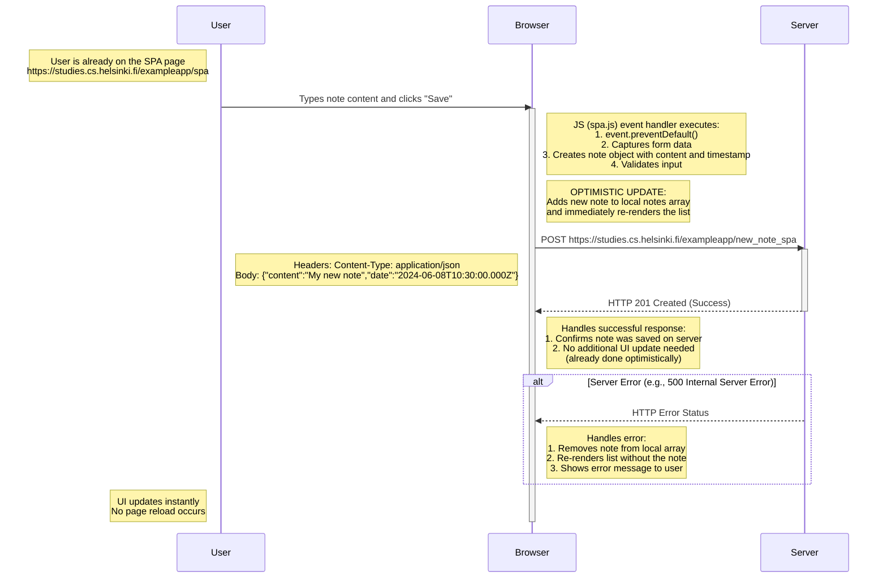

# Sequence Diagram: Creating a New Note in SPA Version

This diagram focuses specifically on the new note creation process in the Single Page Application.

```mermaid
sequenceDiagram
    participant User
    participant Browser
    participant Server

    Note left of User: User is already on the SPA page<br>https://studies.cs.helsinki.fi/exampleapp/spa

    User->>Browser: Types note content and clicks "Save"
    activate Browser

    Note right of Browser: JS (spa.js) event handler executes:<br>1. event.preventDefault()<br>2. Captures form data<br>3. Creates note object with content and timestamp<br>4. Validates input

    Note right of Browser: OPTIMISTIC UPDATE:<br>Adds new note to local notes array<br>and immediately re-renders the list

    Browser->>Server: POST https://studies.cs.helsinki.fi/exampleapp/new_note_spa
    activate Server
    Note left of Browser: Headers: Content-Type: application/json<br>Body: {"content":"My new note","date":"2024-06-08T10:30:00.000Z"}
    Server-->>Browser: HTTP 201 Created (Success)
    deactivate Server

    Note right of Browser: Handles successful response:<br>1. Confirms note was saved on server<br>2. No additional UI update needed<br>(already done optimistically)

    alt Server Error (e.g., 500 Internal Server Error)
        Server-->>Browser: HTTP Error Status
        Note right of Browser: Handles error:<br>1. Removes note from local array<br>2. Re-renders list without the note<br>3. Shows error message to user
    end

    Note left of User: UI updates instantly<br>No page reload occurs
    deactivate Browser
```
