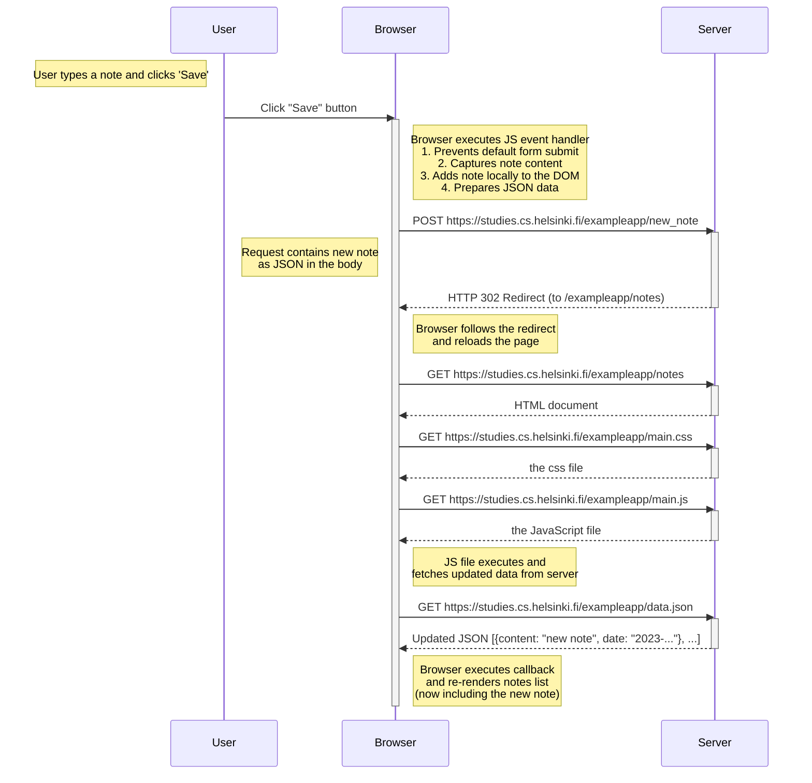

# Sequence Diagram: Creating a New Note

This diagram illustrates the client-server interaction when a user creates a new note on the single-page app.

```mermaid
sequenceDiagram
    participant User
    participant Browser
    participant Server

    Note left of User: User types a note and clicks 'Save'

    User->>Browser: Click "Save" button
    activate Browser

    Note right of Browser: Browser executes JS event handler<br>1. Prevents default form submit<br>2. Captures note content<br>3. Adds note locally to the DOM<br>4. Prepares JSON data

    Browser->>Server: POST https://studies.cs.helsinki.fi/exampleapp/new_note
    activate Server
    Note left of Browser: Request contains new note<br>as JSON in the body
    Server-->>Browser: HTTP 302 Redirect (to /exampleapp/notes)
    deactivate Server

    Note right of Browser: Browser follows the redirect<br>and reloads the page

    Browser->>Server: GET https://studies.cs.helsinki.fi/exampleapp/notes
    activate Server
    Server-->>Browser: HTML document
    deactivate Server

    Browser->>Server: GET https://studies.cs.helsinki.fi/exampleapp/main.css
    activate Server
    Server-->>Browser: the css file
    deactivate Server

    Browser->>Server: GET https://studies.cs.helsinki.fi/exampleapp/main.js
    activate Server
    Server-->>Browser: the JavaScript file
    deactivate Server

    Note right of Browser: JS file executes and<br>fetches updated data from server

    Browser->>Server: GET https://studies.cs.helsinki.fi/exampleapp/data.json
    activate Server
    Server-->>Browser: Updated JSON [{content: "new note", date: "2023-..."}, ...]
    deactivate Server

    Note right of Browser: Browser executes callback<br>and re-renders notes list<br>(now including the new note)
    deactivate Browser
```
