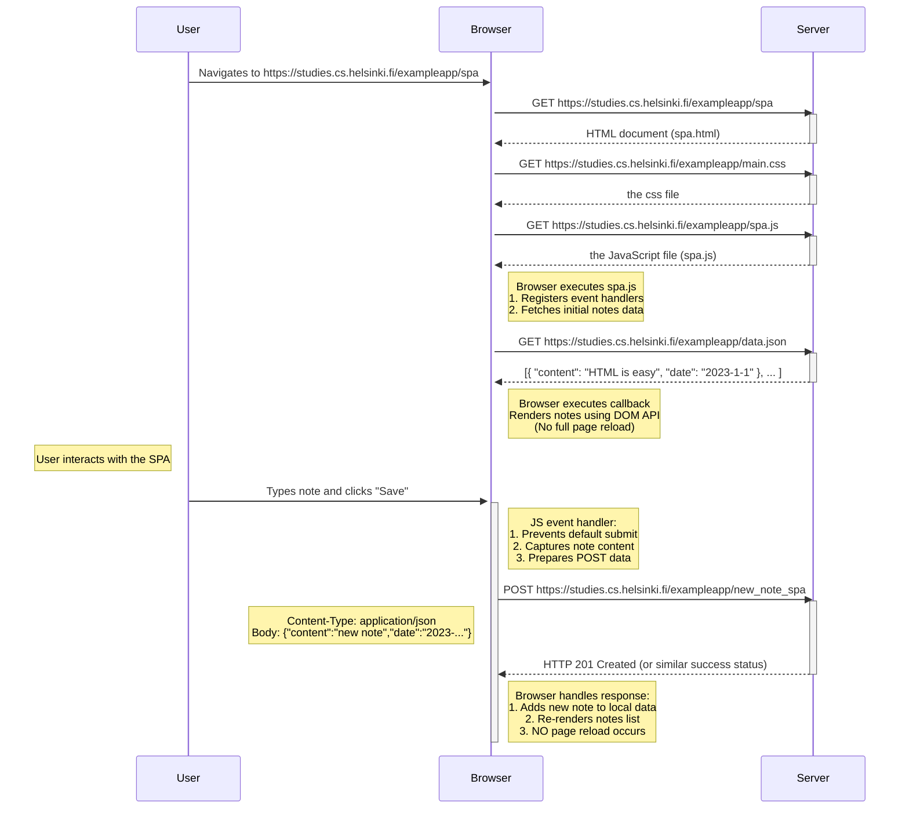

# Sequence Diagram: Single Page App (SPA) Version

This diagram illustrates the client-server interaction when a user accesses the SPA version of the notes app.

```mermaid
sequenceDiagram
    participant User
    participant Browser
    participant Server

    User->>Browser: Navigates to https://studies.cs.helsinki.fi/exampleapp/spa
    activate Browser

    Browser->>Server: GET https://studies.cs.helsinki.fi/exampleapp/spa
    activate Server
    Server-->>Browser: HTML document (spa.html)
    deactivate Server

    Browser->>Server: GET https://studies.cs.helsinki.fi/exampleapp/main.css
    activate Server
    Server-->>Browser: the css file
    deactivate Server

    Browser->>Server: GET https://studies.cs.helsinki.fi/exampleapp/spa.js
    activate Server
    Server-->>Browser: the JavaScript file (spa.js)
    deactivate Server

    Note right of Browser: Browser executes spa.js<br>1. Registers event handlers<br>2. Fetches initial notes data

    Browser->>Server: GET https://studies.cs.helsinki.fi/exampleapp/data.json
    activate Server
    Server-->>Browser: [{ "content": "HTML is easy", "date": "2023-1-1" }, ... ]
    deactivate Server

    Note right of Browser: Browser executes callback<br>Renders notes using DOM API<br>(No full page reload)

    Note left of User: User interacts with the SPA

    User->>Browser: Types note and clicks "Save"
    activate Browser

    Note right of Browser: JS event handler:<br>1. Prevents default submit<br>2. Captures note content<br>3. Prepares POST data

    Browser->>Server: POST https://studies.cs.helsinki.fi/exampleapp/new_note_spa
    activate Server
    Note left of Browser: Content-Type: application/json<br>Body: {"content":"new note","date":"2023-..."}
    Server-->>Browser: HTTP 201 Created (or similar success status)
    deactivate Server

    Note right of Browser: Browser handles response:<br>1. Adds new note to local data<br>2. Re-renders notes list<br>3. NO page reload occurs
    deactivate Browser
```
